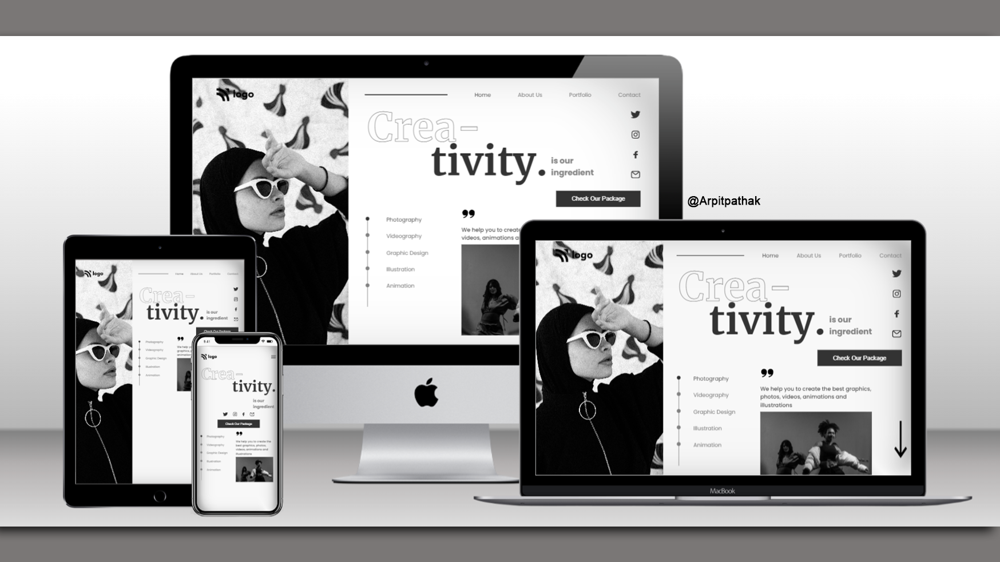

# CREATIVITY Web Page 🌐

## Project 14 🚀 Website's [Live Link](https://crea-tivity.netlify.app/)🔗

>by Arpit Pathak

### Screenshot

### website on different devices

## 📌 What I learned from this Project? 📝

- Learned to use CSS position (Absolute & Relative) properties.
- Learned about text stroke  `-webkit-text-stroke-width` and `-webkit-text-stroke-color` to create outline effect on text.
- Learned about Flexbox and its properties `justify-content`, `align-items`, `gap` & `flex-direction`.
- Learned about Object-fit property that specifies how ``  should be resized to fit their container.

## 📌 Time taken to finish this project ⏳
- 4.5 hours + 40 min to make website responsive
---

